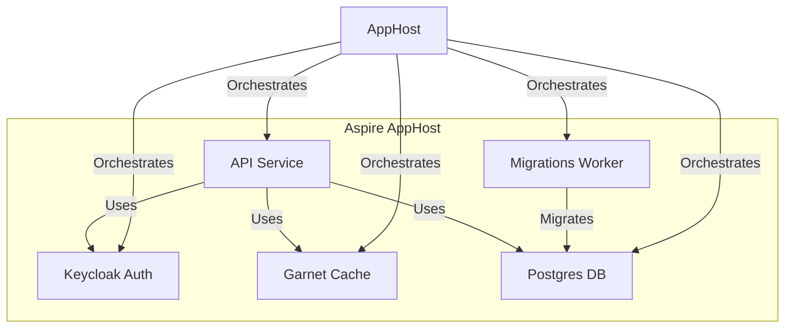
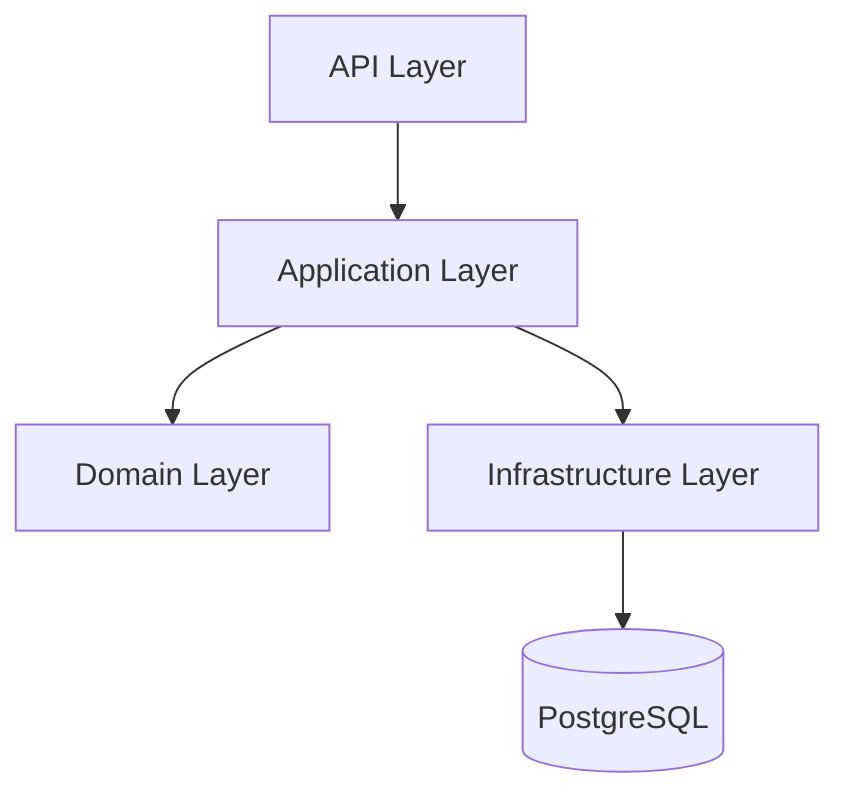
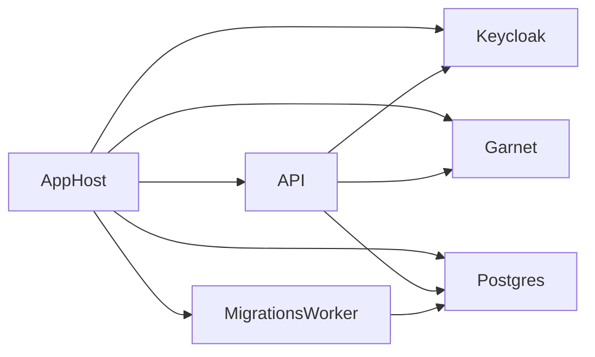

# Employee Management System - Brite Task

## Overview

This is my implementation Brite Task, which  is an Employee Management System, built with .NET 9, leveraging the .NET Aspire stack for cloud-native development and enhanced developer experience. The solution is modular, scalable, and designed for robust service orchestration, observability, and resilience.

### Solution Structure

- **Backend Services**
  - `EM.API`: Main API for employee management.
  - `EM.Application`: Application layer for business logic.
  - `EM.Infrastructure`: Data access and infrastructure concerns.
  - `EM.Domain`: Domain models and core business rules.
  - `EM.MigrationsWorker`: Worker service for database migrations.

- **Aspire Projects**
  - `Brite-Task.AppHost`: Orchestrates services and dependencies using Aspire.
  - `Brite-Task.ServiceDefaults`: Shared project for service defaults (health checks, OpenTelemetry, service discovery).

## Architecture

The solution follows a layered architecture, with clear separation of concerns. Aspire is used for service orchestration, container management, and dependency wiring.



### Key Decisions

- **Aspire for Orchestration:** All services and dependencies are orchestrated via Aspire, enabling easy local development and cloud deployment.
- **Service Defaults:** Common features (health checks, OpenTelemetry, service discovery, resilience) are centralized in `Brite-Task.ServiceDefaults` for consistency.
- **Containerized Dependencies:** Keycloak (auth), Garnet (cache), and PostgreSQL (database) are run as containers, managed by Aspire.
- **Migration Worker:** Database migrations are handled by a dedicated worker service, ensuring schema consistency before API startup.
- **Resilience & Observability:** OpenTelemetry and health checks are enabled by default for all services.

## Running the Solution with Aspire

### Prerequisites

- [.NET 9 SDK](https://dotnet.microsoft.com/download/dotnet/9.0)
- Docker (for running containers)
- Aspire CLI (included with .NET 9 SDK)

### Steps

1. **Build the Solution at the root directory**
```sh
dotnet build
```

2. **Run with Aspire**
   Navigate to the `src/Aspire/Brite-Task.AppHost` directory and run:
```sh
dotnet run
```
   This will:
   - Start all required containers (Keycloak, Garnet, PostgreSQL)
   - Run the migration worker to apply DB migrations
   - Start the API service, wired to all dependencies

4. **Access Services**
   - **API:** Usually available at `http://localhost:PORT` (see output for actual port)
   - **Keycloak Admin:** `http://localhost:8081`
   - **PgAdmin:** `http://localhost:5050`

### Service Health & Observability

- Health checks are exposed at `/health` and `/alive` endpoints.
- OpenTelemetry traces and metrics are enabled for all services.

## Additional Diagrams

### Layered Architecture



### Service Orchestration



## Aspire Dashboard

After running the solution, you can navigate to the Aspire dashboard at [https://localhost:17256/](http://localhost:17256/)

This dashboard provides a visual overview of all running services, dependencies, health, and telemetry information.

## References

- [.NET Aspire Documentation](https://learn.microsoft.com/en-us/dotnet/aspire/)
- [OpenTelemetry for .NET](https://opentelemetry.io/docs/instrumentation/net/)
- [Aspire Service Defaults](https://aka.ms/dotnet/aspire/service-defaults)

---


