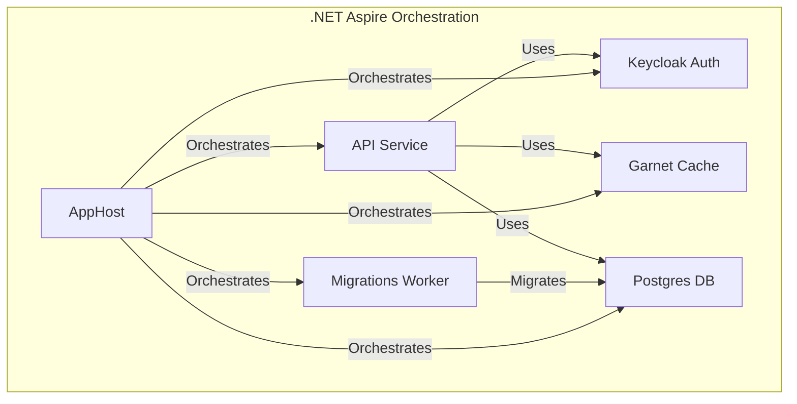
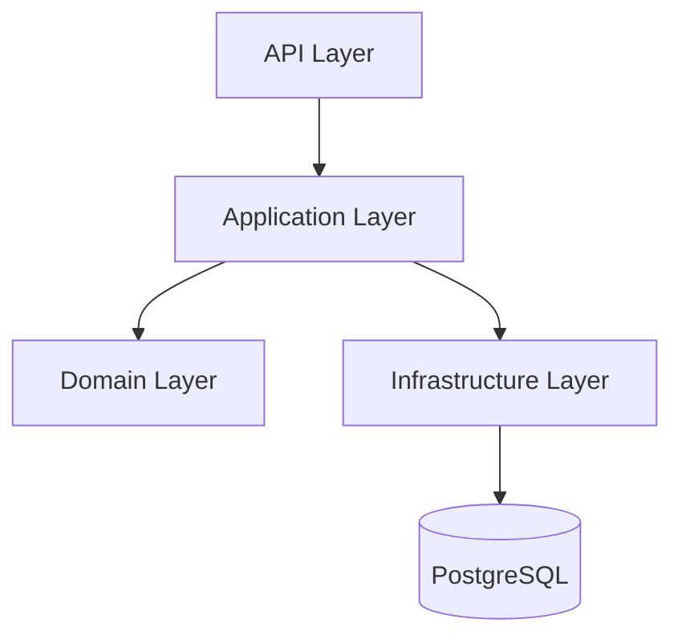
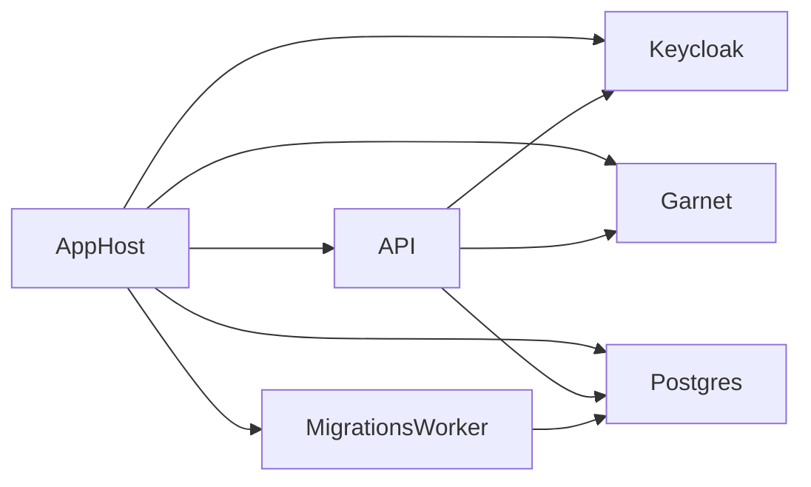

# Employee Management System - Brite Task

## Table of Contents

- [Overview](#overview)
- [Requirements Checklist](#requirements-checklist)
- [Solution Structure](#solution-structure)
- [Architecture](#architecture)
- [Key Decisions](#key-decisions)
  - [Why choose .NET Aspire over Docker Compose?](#why-choose-net-aspire-over-docker-compose)
  - [Why choose PostgreSQL over SQL Server?](#why-choose-postgresql-over-sql-server)
  - [Why choose Microsoft Garnet over Redis?](#why-choose-microsoft-garnet-over-redis)
  - [Why use .NET Minimal APIs over MVC Controllers?](#why-use-net-minimal-apis-over-mvc-controllers)
  - [Why use Keycloak instead of building my own Auth Solution?](#why-use-keycloak-instead-of-building-my-own-auth-solution)
- [Running the Solution with Aspire](#running-the-solution-with-aspire)
  - [Prerequisites](#prerequisites)
  - [Steps](#steps)
  - [Service Health & Observability](#service-health--observability)
- [Additional Diagrams](#additional-diagrams)
  - [Layered Architecture](#layered-architecture)
  - [Service Orchestration](#service-orchestration)
- [Aspire Dashboard](#aspire-dashboard)
- [Test Users](#test-users)
- [Future Work](#future-work)
- [References](#references)

## Overview

This is my implementation for Brite Task, which is an Employee Management System, built with .NET 9, leveraging the .NET Aspire stack for cloud-native development and enhanced developer experience. The solution is modular, scalable, and designed for robust service orchestration, observability, and resilience.

## Requirements Checklist

### Core Features:

✅ Use Clean Architecture or Domain-Driven Design (DDD).

#### Implement the following entities:

✅ Employee (Name, Email, Phone, DepartmentId, RoleId, DateOfJoining, IsActive)

✅ Department (Name, Description)

✅ Role (Name, Permissions as JSON)

#### API Endpoints:

✅ CRUD for Employees, Departments, Roles

✅ Search Employees (by Name, Department, Active Status, Date of Joining range)

✅ Activate / Deactivate Employee

#### Security:

✅ Implement JWT Authentication

✅ Use Role-based Authorization (Admin / HR / Viewer)

✅ Secure all endpoints properly

#### Database:

✅ Use EF Core (Code First) with SQL Server or PostgreSQL

✅ Seed initial data (Admin user, example Departments, Roles)

#### Validation & Error Handling:

✅ Input validation with clear error responses

✅ Global exception handling middleware

#### Documentation:

✅ Provide Swagger / OpenAPI documentation

✅ Clear instructions for running the project

### Bonus (Optional):
❌ Unit tests for core services

✅ Caching (In-Memory / Redis) for Departments & Roles

✅ Health Check endpoint /health

✅ Audit fields (Created By, CreatedAt, UpdatedBy, UpdatedAt)

## Solution Structure

- **Backend Services**
  - `EM.API`: Main API for employee management.
  - `EM.Application`: Application layer for business logic.
  - `EM.Infrastructure`: Data access and infrastructure concerns.
  - `EM.Domain`: Domain models and core business rules.
  - `EM.MigrationsWorker`: Worker service for database migrations, used in Development with .NET Aspire only.

- **Aspire Projects**
  - `Brite-Task.AppHost`: Orchestrates services and dependencies using Aspire.
  - `Brite-Task.ServiceDefaults`: Shared project for service defaults (health checks, OpenTelemetry, service discovery).

## Architecture

The solution follows a layered architecture, with clear separation of concerns. Aspire is used for service orchestration, container management, and dependency wiring.



## Key Decisions

Here are some key decisions made during the development of this assessment, along with their rationale:

### Why choose .NET Aspire over Docker Compose?

.NET Aspire was chosen over Docker Compose primarily for its enhanced developer experience. While Docker Compose is excellent for orchestrating containers, .NET Aspire significantly streamlines the inner development loop for modern, distributed applications, especially within the .NET ecosystem. It simplifies service discovery, manages connection strings automatically, and provides an integrated dashboard for observability and debugging, all configured with C# code. This reduces boilerplate and configuration overhead, allowing developers to focus more on business logic and less on infrastructure setup, leading to faster development cycles and improved productivity compared to manual Docker Compose configurations and troubleshooting.

### Why choose PostgreSQL over SQL Server?

While SQL Server is a strong contender, especially within the Microsoft ecosystem, PostgreSQL was chosen for its compelling advantages in performance and industry adoption. PostgreSQL is renowned for its robust performance, particularly in handling complex queries and large datasets, often outperforming SQL Server in specific benchmarks. Furthermore, its open-source nature has led to widespread adoption across various industries and platforms, fostering a large and active community, extensive tooling, and broad cloud provider support. This provides greater flexibility, cost efficiency (due to no licensing fees), and future-proofing for the solution.

### Why choose Microsoft Garnet over Redis?

Microsoft Garnet was selected over Redis primarily due to its superior throughput capabilities. Garnet, a modern, open-source, and high-performance in-memory key-value store from Microsoft Research, has demonstrated significantly higher throughput and better scalability with many client connections, particularly for small batch operations. This performance edge can lead to substantial cost savings for large-scale applications and services by requiring fewer resources to handle the same load, while still being compatible with existing Redis clients.

### Why use .NET Minimal APIs over MVC Controllers?

.NET Minimal APIs were chosen over traditional MVC Controllers for their modern approach and performance benefits. Minimal APIs offer a streamlined, lightweight way to build HTTP APIs with significantly less boilerplate code, making them faster to write and easier to read. They are inherently more performant due to their leaner pipeline and reduced overhead, making them ideal for microservices and high-performance scenarios. This choice aligns with modern architectural patterns and allows for a more concise and efficient development of API endpoints.

### Why use Keycloak instead of building my own Auth Solution?

Keycloak was chosen over building a custom authentication solution due to its comprehensive features, robust security compliance, and reduced development overhead. Building a secure and feature-rich authentication and authorization system from scratch is a complex and time-consuming endeavor, fraught with potential security vulnerabilities. Keycloak, as an open-source Identity and Access Management (IAM) solution, provides out-of-the-box support for industry standards like OAuth 2.0, OpenID Connect, and SAML 2.0, along with features like multi-factor authentication, user federation, single sign-on (SSO), Multi-Tenants by design and fine-grained access control. This ensures high security compliance and allows developers to focus on core business logic rather than reinventing the wheel for security.

### Why use ProblemDetails over custom error responses?

Preferring ProblemDetails over custom response bodies aligns with best practices for API design, especially in a modern application. It leverages a well-defined standard, promoting consistency and easier consumption for clients, while still providing the flexibility needed to convey application-specific error information. Leveraging the built-in support for ProblemDetails in ASP.NET Core (ValidationProblemDetails, ProblemDetailsFactory) makes this even more straightforward.

## Running the Solution with Aspire

### Prerequisites

- [.NET 9 SDK](https://dotnet.microsoft.com/download/dotnet/9.0)
- Docker / Podman (for running containers)
- .NET Aspire SDK (from VS Installer, under Individual Components)

### Steps

1. **Build the Solution at the root directory**
```sh
dotnet build
```

2. **Run with Aspire**
   Navigate to the `src/Aspire/Brite-Task.AppHost` directory and run:
```sh
dotnet run
```
   This will:
   - Start all required containers (Keycloak, Garnet, PostgreSQL)
   - Run the migration worker to apply DB migrations
   - Start the API service, wired to all dependencies

3. **Access Services**
   - **API:** `http://localhost:7157/scalar`
   - **Keycloak Admin:** `http://localhost:8081`
   - **PgAdmin:** `http://localhost:5050`

### Service Health & Observability

- Health checks are exposed at `/health` and `/alive` endpoints.
- OpenTelemetry traces and metrics are enabled for all services.

## Additional Diagrams

### Layered Architecture



### Service Orchestration



## Aspire Dashboard

After running the solution, you can navigate to the Aspire dashboard at [https://localhost:17256/](http://localhost:17256/)

In case you are prompted for a token, check the Logs in terminal and use the token provided by .NET Aspire (http://localhost:17256/login?t=<login-token>)

This dashboard provides a visual overview of all running services, dependencies, health, and telemetry information.

## Test Users

Below is a table of test users you can use to try out the system. Use these credentials to log in via Keycloak or to test API authentication. JWT Tokens can be generated after login via the authentication endpoint or Keycloak UI.

| Username | Email             | Password   | Role  | JWT Token      |
|----------|-------------------|------------|-------|---------------|
| bob      | bob@example.com   | bob  | HR  | eyJhbGciOiJSUzI1NiIsInR5cCIgOiAiSldUIiwia2lkIiA6ICJhbHdpanU4Z05zZ1lvMjQ2dmpJY09iQTlDcmpSZmJZTkgxblVaOHdDZDMwIn0.eyJleHAiOjE3NTM3Nzc4MjAsImlhdCI6MTc1MzM0NTgyMCwiYXV0aF90aW1lIjoxNzUzMzQ0OTYyLCJqdGkiOiJvZnJ0cnQ6MmYyZDgzMDYtODY3Mi1jZjYyLTExNWItYzFkNmExOGNhZTY3IiwiaXNzIjoiaHR0cDovL2xvY2FsaG9zdDo4MDgxL3JlYWxtcy90ZW5hbnQtMSIsImF1ZCI6ImFjY291bnQiLCJzdWIiOiI4YTM2Mzc4MC02MzYyLTRlNGItOGM1Zi03Yzk3MGY1NzI1YmQiLCJ0eXAiOiJCZWFyZXIiLCJhenAiOiJiYWNrZW5kLTEiLCJzaWQiOiIzOTg3ZDc0Yi1iMjhiLTRhNTEtYmJmYS02ZGUxODFiNjk5ZTYiLCJhY3IiOiIxIiwiYWxsb3dlZC1vcmlnaW5zIjpbImh0dHBzOi8vb2F1dGgucHN0bW4uaW8iLCJodHRwczovL2xvY2FsaG9zdDo3MTU3Il0sInJlYWxtX2FjY2VzcyI6eyJyb2xlcyI6WyJvZmZsaW5lX2FjY2VzcyIsImRlZmF1bHQtcm9sZXMtdGVuYW50LTEiLCJIUiIsInVtYV9hdXRob3JpemF0aW9uIl19LCJyZXNvdXJjZV9hY2Nlc3MiOnsiYWNjb3VudCI6eyJyb2xlcyI6WyJtYW5hZ2UtYWNjb3VudCIsIm1hbmFnZS1hY2NvdW50LWxpbmtzIiwidmlldy1wcm9maWxlIl19fSwic2NvcGUiOiJvcGVuaWQgb2ZmbGluZV9hY2Nlc3MgZW1haWwgcHJvZmlsZSIsImVtYWlsX3ZlcmlmaWVkIjp0cnVlLCJuYW1lIjoiQm9iIFRoZSBCdWlsZGVyIiwicHJlZmVycmVkX3VzZXJuYW1lIjoiYm9iIiwiZ2l2ZW5fbmFtZSI6IkJvYiIsImZhbWlseV9uYW1lIjoiVGhlIEJ1aWxkZXIiLCJlbWFpbCI6ImJvYkBleGFtcGxlLmNvbSJ9.BbqiyB3zQo0VDj7eb-OE9vqc8YuMk8OB6N_65zypJOEmUqgOehsZebQOUH6Q8R_vQEdG9Q0lbxeGhd5SBLC5FaUMHZ_TQuI9y58o9JUKYUQEcSxsJALtaMCAdDJ0b97tOSl5_teoannI3rXRTIwshLtI9r7R8ohrKzGRoNVNqFTy1udIS2kuLQV2yvNXIVc5nJJt_pELcPG2dzqOafsGDH94ISyE9TmPHzQlupx84oSbRqHGOJEOmTCbHT7Ht_5CEN_XlbU-7U6t8G1qwfgJaiKnr_EXfGmXcOuiy5T0og5pDZ--vtqyX099WEa9JrusTWWdLZXfXzmXcz6IEXaPhg |
| alice    | alice@example.com | alice  | Viewer  | eyJhbGciOiJSUzI1NiIsInR5cCIgOiAiSldUIiwia2lkIiA6ICJhbHdpanU4Z05zZ1lvMjQ2dmpJY09iQTlDcmpSZmJZTkgxblVaOHdDZDMwIn0.eyJleHAiOjE3NTM3Nzc4NzEsImlhdCI6MTc1MzM0NTg3MSwiYXV0aF90aW1lIjoxNzUzMzQ1MTgxLCJqdGkiOiJvZnJ0cnQ6YzZiNGM4OWUtMzljZi0zZjhmLTY1MzEtYmM1MTNiYjFiZjIwIiwiaXNzIjoiaHR0cDovL2xvY2FsaG9zdDo4MDgxL3JlYWxtcy90ZW5hbnQtMSIsImF1ZCI6ImFjY291bnQiLCJzdWIiOiI4M2YzMmJjMS0xYzg3LTRlMzItODYyYi1iZGY4MWU0NTNhNmEiLCJ0eXAiOiJCZWFyZXIiLCJhenAiOiJiYWNrZW5kLTEiLCJzaWQiOiIzMDBlYWY1Mi1lZjk0LTQ2NDEtOWM2Yi1hMzQxNTk1NWIxYTYiLCJhY3IiOiIxIiwiYWxsb3dlZC1vcmlnaW5zIjpbImh0dHBzOi8vb2F1dGgucHN0bW4uaW8iLCJodHRwczovL2xvY2FsaG9zdDo3MTU3Il0sInJlYWxtX2FjY2VzcyI6eyJyb2xlcyI6WyJvZmZsaW5lX2FjY2VzcyIsImRlZmF1bHQtcm9sZXMtdGVuYW50LTEiLCJWaWV3ZXIiLCJ1bWFfYXV0aG9yaXphdGlvbiJdfSwicmVzb3VyY2VfYWNjZXNzIjp7ImFjY291bnQiOnsicm9sZXMiOlsibWFuYWdlLWFjY291bnQiLCJtYW5hZ2UtYWNjb3VudC1saW5rcyIsInZpZXctcHJvZmlsZSJdfX0sInNjb3BlIjoib3BlbmlkIG9mZmxpbmVfYWNjZXNzIGVtYWlsIHByb2ZpbGUiLCJlbWFpbF92ZXJpZmllZCI6dHJ1ZSwibmFtZSI6IkFsaWNlIFdvbmRlcmxhbmQiLCJwcmVmZXJyZWRfdXNlcm5hbWUiOiJhbGljZSIsImdpdmVuX25hbWUiOiJBbGljZSIsImZhbWlseV9uYW1lIjoiV29uZGVybGFuZCIsImVtYWlsIjoiYWxpY2VAZXhhbXBsZS5jb20ifQ.sPLxHIY0t1DpUjAzxbAVTJi1QWtUhV4sTTx8FJPP4vJWZBMS8NNePK4Uf8o6T15vqEUUK-28h75Ahe3BbjL6HkI7paLRpt3iaaMZVf13eMP158Vgrr3quz-CkTt4Qn6_hAdVGkUTe3mF5gMVZeIB2hOnqo9qDm3cLeVYXE9gjvN6QgkHC-CKqS9b97Iz42nKcacy2SGzKHhNE67G1S-hPRHC4o5hv7GGRrp9aumz1S0xb1W1HOdSPFEvCV1qtERnuyMUGlwYBvnjQ7aSyS0SKsvuwJNr41NbvVOem8PeWvUiAcJhXoTos2f8ZiRKC-grdW045g_PKrZlIzU7FZeDEA |
| admin    | admin@example.com | admin  | Admin | eyJhbGciOiJSUzI1NiIsInR5cCIgOiAiSldUIiwia2lkIiA6ICJhbHdpanU4Z05zZ1lvMjQ2dmpJY09iQTlDcmpSZmJZTkgxblVaOHdDZDMwIn0.eyJleHAiOjE3NTM3Nzc5MjUsImlhdCI6MTc1MzM0NTkyNSwiYXV0aF90aW1lIjoxNzUzMzQ1MjQ0LCJqdGkiOiJvZnJ0cnQ6MThmOTA4YzMtMjJkNi0yMDBiLTRlMjAtZmQ3YzNkZDYwYmNlIiwiaXNzIjoiaHR0cDovL2xvY2FsaG9zdDo4MDgxL3JlYWxtcy90ZW5hbnQtMSIsImF1ZCI6ImFjY291bnQiLCJzdWIiOiIzYTdkMmM5ZC1kNjM5LTQ3NWYtOTE0OC0wMzBmMzdlZjQ0N2IiLCJ0eXAiOiJCZWFyZXIiLCJhenAiOiJiYWNrZW5kLTEiLCJzaWQiOiIyY2YwN2YxOC1kMWFjLTQ2Y2EtYmM3Yi1kMDVmMWEyY2I0MzkiLCJhY3IiOiIxIiwiYWxsb3dlZC1vcmlnaW5zIjpbImh0dHBzOi8vb2F1dGgucHN0bW4uaW8iLCJodHRwczovL2xvY2FsaG9zdDo3MTU3Il0sInJlYWxtX2FjY2VzcyI6eyJyb2xlcyI6WyJvZmZsaW5lX2FjY2VzcyIsImRlZmF1bHQtcm9sZXMtdGVuYW50LTEiLCJ1bWFfYXV0aG9yaXphdGlvbiIsIkFkbWluIl19LCJyZXNvdXJjZV9hY2Nlc3MiOnsiYWNjb3VudCI6eyJyb2xlcyI6WyJtYW5hZ2UtYWNjb3VudCIsIm1hbmFnZS1hY2NvdW50LWxpbmtzIiwidmlldy1wcm9maWxlIl19fSwic2NvcGUiOiJvcGVuaWQgb2ZmbGluZV9hY2Nlc3MgZW1haWwgcHJvZmlsZSIsImVtYWlsX3ZlcmlmaWVkIjp0cnVlLCJuYW1lIjoiQWRtaW5pc3RyYXRvciBhZG1pbiIsInByZWZlcnJlZF91c2VybmFtZSI6ImFkbWluaXN0cmF0b3IiLCJnaXZlbl9uYW1lIjoiQWRtaW5pc3RyYXRvciIsImZhbWlseV9uYW1lIjoiYWRtaW4iLCJlbWFpbCI6ImFkbWluQGV4YW1wbGUuY29tIn0.HT8hC4C9xqSSEN7k0MSqyzwD6AOLVKv2XgJFdfyPyaTOV5d5qAzufWafUP1lSswhKCUe3oQqLzdTY2Zbh9BgGVLtkmDaoqiiQogh_WgtRJQhw-ytCaRkHFZ4ezk93DIGLP0ngHNgQgzN9FO2wEPNZiQq3GPPuS-ILq95Z9-DCzenKrQz5p-RWmZmEorK5enn9Rp42pEOpZgFVJt9KUb2j0tNOdtQOmOJgAUUxhWwjiQfTec9V7x9fkxSkdqQh1SWEns_FjjFyAI9Pe1VBseUr3LG_fBoz6gCsUuYQi4CfhVX1IVllXbDwv7WvX51EHwvaoCcAqTRtxUM74HL9yufcw |

For Keycloak admin dashboard credentials, use the following: `admin` - `admin`

## Future Work

- **Add DTOs for all endpoints:**
  Implementing Data Transfer Objects (DTOs) for all API endpoints will provide better control over the data exposed to clients, improve security by preventing over-posting, and enable more flexible response shaping.

- **Add Unit / Architecture Tests:**
  Introducing comprehensive unit and architecture tests will help ensure code quality, maintainability, and adherence to architectural guidelines, providing greater confidence in future changes and deployments.

- **Sync Data between API and Keycloak:**
  Implementing synchronization between the API's user data and Keycloak will ensure consistency across authentication and business domains, reducing the risk of mismatched or stale user information.

## References

- [.NET Aspire Documentation](https://learn.microsoft.com/en-us/dotnet/aspire/)
- [OpenTelemetry for .NET](https://opentelemetry.io/docs/instrumentation/net/)
- [Aspire Service Defaults](https://aka.ms/dotnet/aspire/service-defaults)
